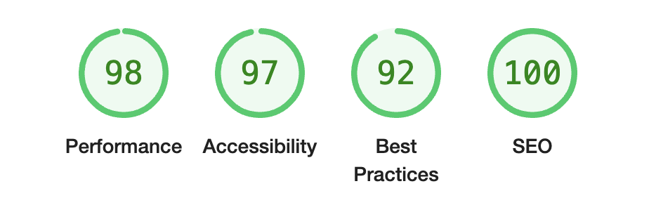
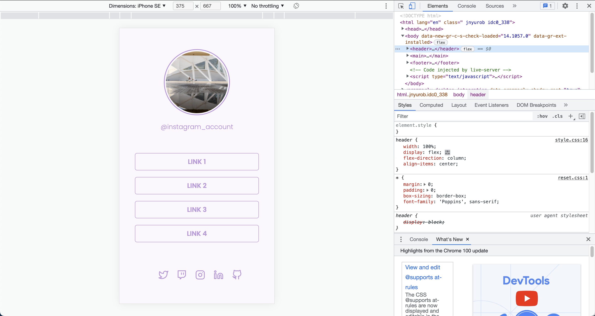

## 🌐 Social Links 👑

  

### 🚀 Sobre

O Social Links é um desafio proposto na trilha Discover da Rocketseat onde criamos uma interface que lista vários links da biografia de algum perfil do Instagram.

### 💡 Lighthouse



### 🖼️ Projeto

Projeto rodando Desktop




### 🏃‍♂️ Como rodar o projeto

Realize um clone do repositório, abra a pasta e execute o arquivo index.html:

```bash
git clone https://github.com/Seiixas/social-links-discover
cd social-links-discover
```

Ou acesse o site on-line pelo Github Pages [clicando aqui](https://seiixas.github.io/social-links-discover.).
